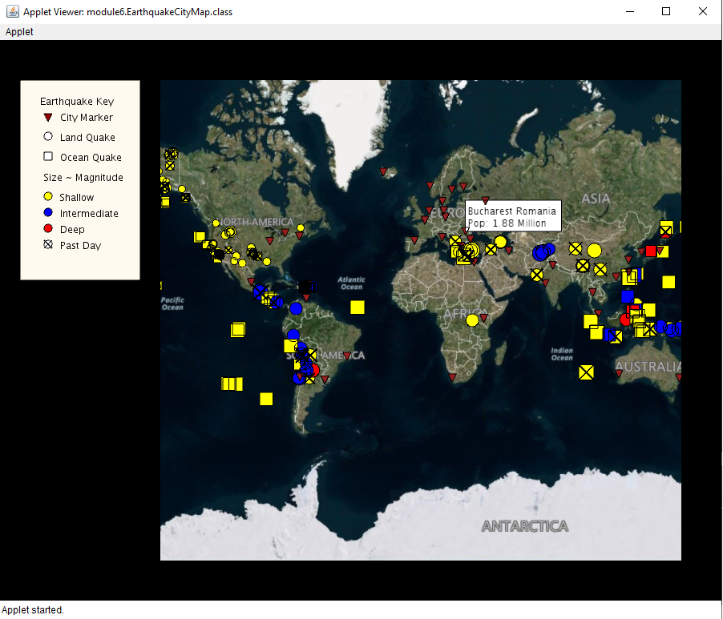

# quakewatch

Interactive Java Applet to map real world earthquake data from the U.S. Geological Survey on the basis of magnitude, depth, recency, and threat radius. 
- Earthquake data from https://earthquake.usgs.gov/earthquakes/
- UnfoldingMaps: http://unfoldingmaps.org
- Processing: https://processing.org

# Final version contained in Module 6
Features include:
- Land and sea tremors from past 2.5 weeks visualized and color coded on the basis of magnitude

- Quakes ocurring in the past day are marked with an X

- Calculates approximate threat-radii of tremors to classify display that are immediately threatened

- Mouse Hover
  - Display name and magnitude over other elements

- Mouse Clicks
  - City Markers:
    - Display earthquakes in whose threat radii a city may fall in
    - Hide other city markers
  - Earthquake Markers:
    - Show cities which may fall in its threat circle
    - Hide other earthquake markers
  - Double click to zoom

(From UCSD)
unfolding_app_template and UC San Diego/Coursera MOOC starter code
==================================================================

This is a skeleton to use Unfolding in Eclipse as well as some starter code for the Object Oriented Programming in Java course offered by UC San Diego through Coursera.

For more examples visit http://unfoldingmaps.org, or download the template with examples.

The module folders contain the starter code for the programming assignments associated with the MOOC.

INSTALLATION

Import this folder in Eclipse ('File' -> 'Import' -> 'Existing Projects into
Workspace', Select this folder, 'Finish')

MANUAL INSTALLATION

If the import does not work follow the steps below.

- Create new Java project
- Copy+Paste all files into project
- Add all lib/*.jars to build path
- Set native library location for jogl.jar. Choose appropriate folder for your OS.
- Add data/ as src

TROUBLE SHOOTING

Switch Java Compiler to 1.6 if you get VM problems. (Processing should work with Java 1.6, and 1.7)
